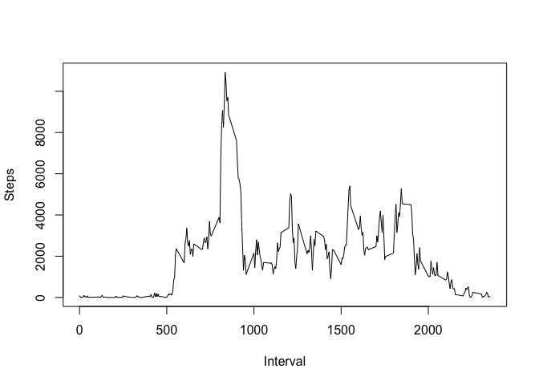
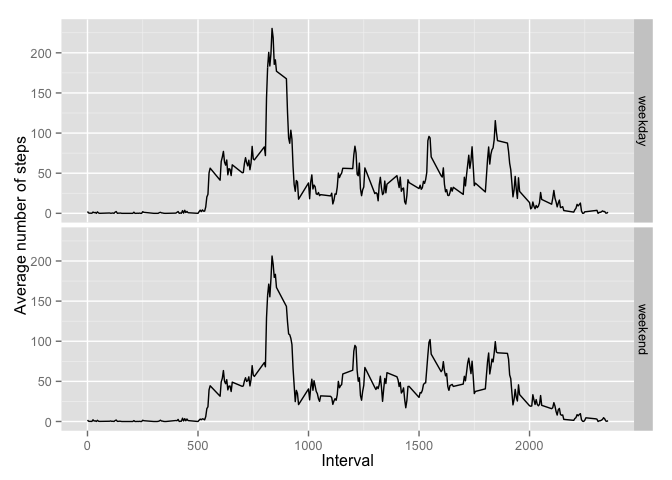

# Reproducible Research: Peer Assessment 1


## Loading and preprocessing the data

```r
data <- read.csv("activity.csv")
data$date <- as.Date(data$date)
```


## What is mean total number of steps taken per day?
First a histogram of the total number of steps taken each day is plotted

```r
library(ggplot2)
library(scales)
stepsD <- aggregate(steps~date, data = data, sum)
ggplot(stepsD, aes(x=date, y=steps))+ geom_histogram(stat = "identity")+scale_x_date(labels=date_format("%d-%b-%y"), breaks = "1 day") + theme(axis.text.x = element_text(angle=90))
```

 

The mean of total steps taken per day

```r
mean(stepsD$steps, na.rm = TRUE)
```

```
## [1] 10766.19
```

The median of total steps taken per day

```r
median(stepsD$steps, na.rm = TRUE)
```

```
## [1] 10765
```

## What is the average daily activity pattern?
The time series plot of the 5-minute interval and the average number of steps taken, averaged across all days

```r
stepsI <- aggregate(steps~interval, data = data, sum)
plot.ts(stepsI$interval, stepsI$steps,  type="l", xlab= "Interval", ylab= "Steps")
```

 

The 5-minute interval, on average across all the days in the dataset, that contains maximum number of steps

```r
colMax <- function(data) sapply(data, max, na.rm = TRUE)
interval <- colMax(stepsI)
interval[1]
```

```
## interval 
##     2355
```

## Imputing missing values
Calculate and report the total number of missing values in the dataset

```r
sum(!complete.cases(data))
```

```
## [1] 2304
```
The strategy for filling in all of the missing values in the dataset is the mean for that 5-minute interval
Create a new dataset that is equal to the original dataset but with the missing data filled in

```r
stepsM <- aggregate(steps~interval, data = data, mean)
newdataset <- data
for (i in 1:nrow(data)){
    if (is.na(newdataset[i,"steps"])){
        newdataset[i,]$steps <- stepsM[stepsM$interval==newdataset[i, "interval"],"steps"] 
    }
}
```

Histogram of the total number of steps taken each day

```r
nstepsD <- aggregate(steps~date, data = newdataset, sum)
ggplot(nstepsD, aes(x=date, y=steps))+ geom_histogram(stat = "identity")+scale_x_date(labels=date_format("%d-%b-%y"), breaks = "1 day") + theme(axis.text.x = element_text(angle=90))
```

 

The mean of total steps taken per day

```r
mean(nstepsD$steps)
```

```
## [1] 10766.19
```

The median of total steps taken per day

```r
median(nstepsD$steps)
```

```
## [1] 10766.19
```

The mean remains the same as NA are filled in with the mean of each interval. The median changes to be the same of the mean.

There is no impact of imputing missing data on the estimates of the total daily number of steps.

```r
nstepsI <- aggregate(steps~interval, data = newdataset, sum)
plot.ts(nstepsI$interval, nstepsI$steps,  type="l", xlab= "Interval", ylab= "Steps")
```

 

```r
interval <- colMax(nstepsI)
interval[1]
```

```
## interval 
##     2355
```

## Are there differences in activity patterns between weekdays and weekends?
Create a new factor variable in the dataset with two levels – “weekday” and “weekend” indicating whether a given date is a weekday or weekend day.

```r
for (i in 1:nrow(newdataset)){
    if (weekdays(newdataset[i,"date"])== "sábado"| weekdays(newdataset[i,"date"])=="domingo"){
        newdataset[i,"daytype"] <-"weekend"
    } else {
        newdataset[i,"daytype"] <-"weekday"
    }
}
```

Plot containing a time series plot of the 5-minute interval (x-axis) and the average number of steps taken, averaged across all weekday days or weekend days (y-axis).


```r
weekenddata <- newdataset[newdataset$daytype=="weekend",]
weekdaydata <- newdataset[newdataset$daytype=="weekday",]
wenstepsM <- aggregate(steps~interval, data = newdataset, mean)
wdnstepsM <- aggregate(steps~interval, data = weekdaydata, mean)
wenstepsM$daytype <- "weekend"
wdnstepsM$daytype <- "weekday"
plotdata <- rbind(wenstepsM, wdnstepsM)
g <- ggplot(plotdata, aes(interval, steps))
g+ geom_line()+ facet_grid(daytype ~ .) + labs(x="Interval", y="Average number of steps")
```

 

